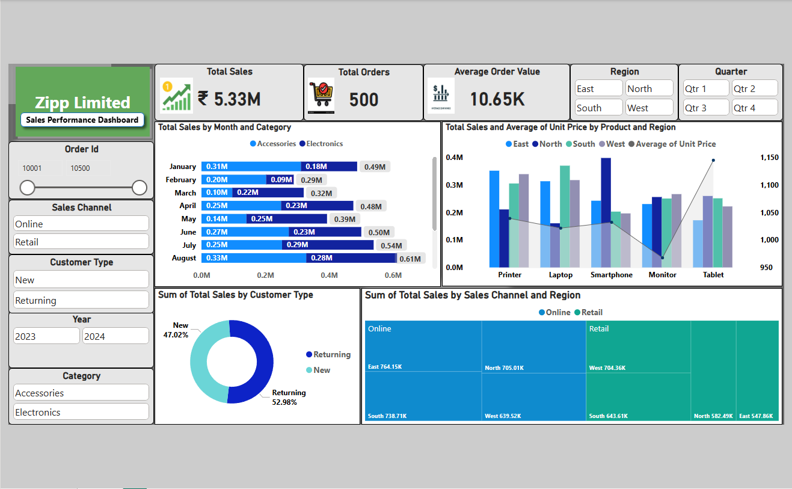

# Sales-Performance-Dashboard-PowerBI
Interactive Sales Performance Dashboard built using Power BI.
 #Project Overview

This project analyzes sales performance across regions, products, customer types, and sales channels using interactive Power BI visualizations.

## Key KPIs

1. Total Sales: ₹5.33M
2. Total Orders: 500
3. Average Order Value: ₹10.65K

## Features

- Monthly sales trend analysis
- Product vs Price comparison
- Customer type distribution
- Sales channel and region breakdown
- Interactive filters (Region, Category, Year, Quarter)

## Tools Used

- Power BI
- Excel

## Dashboard Preview

###  Business Insights
- Returning customers contribute 52.98% of total sales.
- August recorded peak sales.
- Tablet has highest unit price but lower sales volume.
- Online channel dominates East & South regions.
